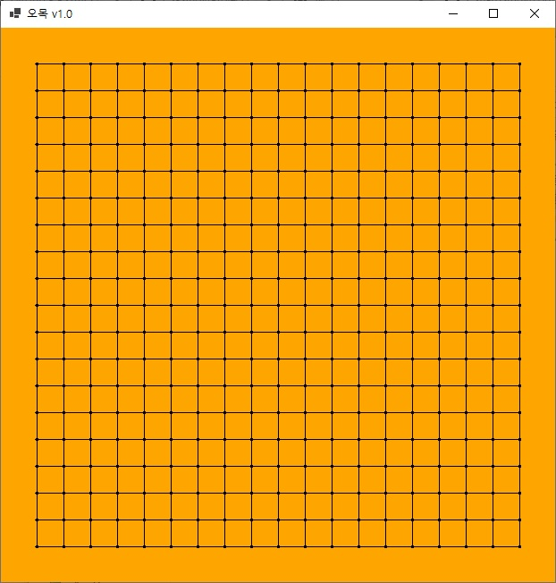

# c\# 프로그래밍

## Ch01. Hello World!
## Ch02. 변수와 자료형 그리고 연산자
	- 1. 변수
	- 2. 자료형
	- 3. 연산자
	- 4. 기본 입력
	- 5. 자료형 변환
	- 6. 문자열
	
## Ch03. 

## Ch04. 

## Ch05. 

## Ch06. 

## Ch07. 

## Ch08. 

## Project1. 계산기

## Project2. 데이터베이스

## Project3. 오목
	- 흰돌 바둑돌이 번갈아가며 놓으며 가로,세로,대각선 상관엉ㅄ이 먼저 5개를 연속해서 놓으면 승리
	- 승리하는 즉시 새로운 게임을 할것인지 물으며 예/아니오 선택시 새게임/종료 됨

## Project4. 벽돌깨기 게임

