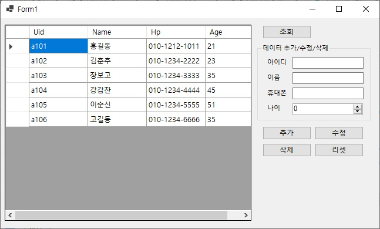
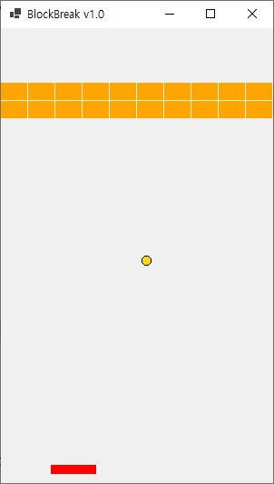

# c\# 프로그래밍

## Ch01. Hello World!

## Ch02. 변수와 자료형 그리고 연산자
	- 1. 변수
	- 2. 자료형
	- 3. 연산자
	- 4. 기본 입력
	- 5. 자료형 변환
	- 6. 문자열
	
## Ch03. 조건문과 반복문
	- 1. If 조건문
	- 2. Switch 조건문
	- 3. for 반복문
	- 4. While 반복문
	- 5. 배열과 반복문

## Ch04. 메서드
	- 1. 메서드 기본 형태
	- 2. 메서드 타입 세가지
	- 3. 메서드 오버로딩(Overloading)
	- 4. 메서드 스택(Stack)
	- 5. 메서드 출력전용 매개변수(Reference)
	
## Ch05. 클래스
	- 1. 클래스와 객체
	- 2. 캡슐화(Encapsulation)
	- 3. 클래스 변수, 메서드와 싱글톤 객체(Singleton)
	- 4. 상속
	- 5. 오버라이드(Override)
	- 6. 다형성(Polymorphism)

## Ch06. 클래스 심화
	- 1. 추상 클래스(Abstract Class)
	- 2. 인터페이스(Interface)
	- 3. 구조체(Structure)
	- 4. 제네릭(Generic)
	- 5. 인덱서(Indexer)
	- 6. 내장 클래스

## Ch07. 컬렉션
	- 1. Stack
	- 2. Queue
	- 3. ArrayList
	- 4. HashTable/Dictionary
	- 5. HashSet
	
## Ch08. 예외 처리
	- 1. 예외와 기본 예외 처리
	- 2. 예외 처리(Throw)
	- 3. 파일 입출력(I/O)

## Ch09. 델리게이터와 람다, Linq
	- 1. 대리자(Delegate)
	- 2. 람다식(Lambda)
	- 3. 링크(Linq;Langeuage Intergrated Query)
	
## Ch10. 데이터베이스 프로그래밍
	- 1. 데이터베이스 접속(DBConnection)
	- 2. 데이터베이스에 정보 추가(Insert)
	- 3. 데이터베이스에 추가 된 정보 불러오기(Select)

## Project1. 계산기
	1. 프로젝트 유형
		- WinForm 프로젝트
	2. 활용기술
		- 컨트롤
		- 이벤트 핸들러

		
## Project2. 데이터베이스
	1. 프로젝트 유형
		- WinForm 프로젝트
	2. 활용기술
		- 컨트롤
		- 이벤트 핸들러
		- 데이터베이스와 SQL

		
## Project3. 오목
	1. 프로젝트 유형
		- WinForm 프로젝트
	2. 활용기술
		- 윈도우 그래픽
		- 이벤트와 핸들러

	// 흰돌 바둑돌이 번갈아가며 놓으며 가로,세로,대각선 상관없이 먼저 5개를 연속해서 놓으면 승리
	// 승리하는 즉시 새로운 게임을 할것인지 물으며 예/아니오 선택시 새게임/종료 됨

## Project4. 벽돌깨기 게임
	1. 프로젝트 유형
		- WinForm 프로젝트
	2. 활용기술
		- 윈도우 그래픽
		- 이벤트와 핸들러

		
# CS-Study
